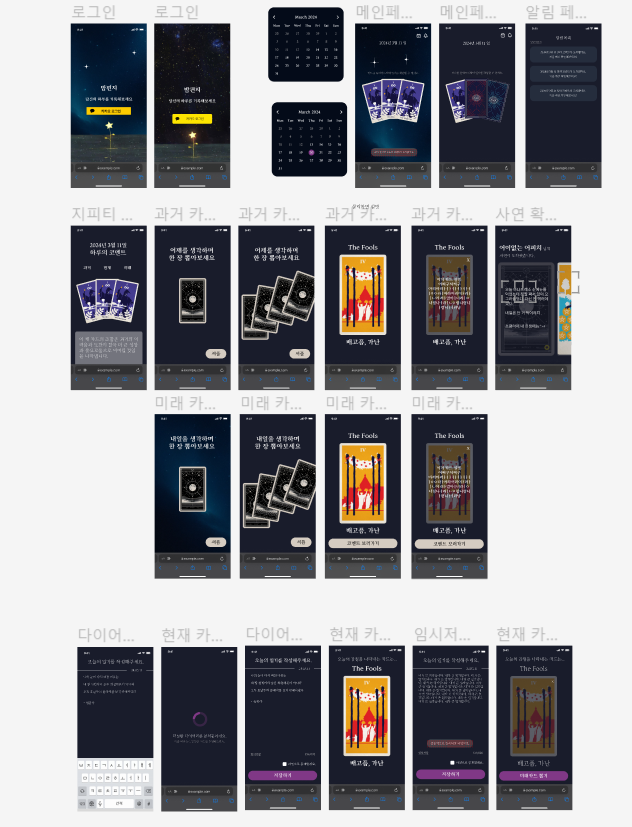
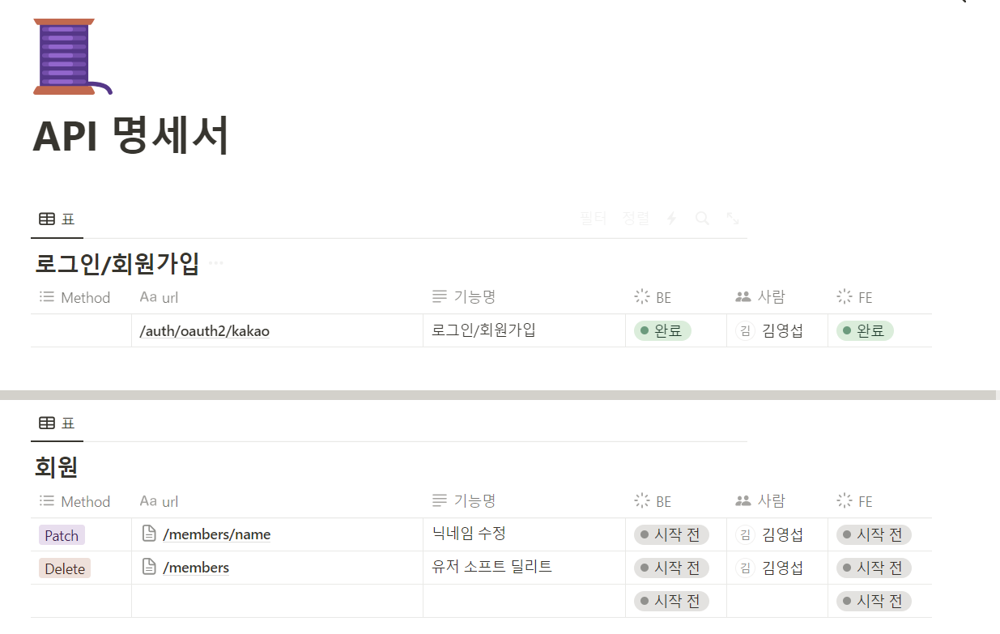

# 목차

1. [**서비스 소개**](#💌서비스-소개)
2. [**기획 배경**](#💌기획-배경)
3. [**개발 멤버**](#💌개발-멤버-및-일정-소개)
4. [**기능 소개**](#💌기능-소개)
5. [**시연 영상**](#💌시연-영상)
6. [**기술 스택**](#💌기술-스택)
7. [**프로젝트 일정 및 산출물**](#💌프로젝트-산출물)
8. [**회고**](#💌회고)
    

---

 

# 💌서비스 소개

## 서비스 설명

### 개요

- 서비스 명 : **`밤편지`**
- 한줄 소개 : **`타로 카드` 컨셉의 `감성 다이어리`**

### 타겟 🎯

- 일기를 작성하며 하루를 갈무리하고 싶은 사람 📝
- 따뜻한 말 한마디가 그리운 사람 😢
- 오늘의 이야기를 나누고 싶은 사람 💗

# 💌기획 배경

## 배경

오늘 하루는 어떠셨나요?

어쩌면 오늘은 새로운 도전에 첫 발을 내딛었을 수도 있고, 사랑하는 이와의 소소한 다툼으로 마음이 무거웠을 수도 있습니다. 때로는 그저 누군가의 따뜻한 말 한마디가 그리울 수도 있죠.

가끔은 누군가에게 자랑을 하고 싶기도, 위로를 받고 싶기도 해요. 하지만 나만의 내밀한 일기를 남에게 보여주는 건 언제나 떨리고 부담스러운 일이죠.

`밤편지`를 받아보세요. 당신의 일상 속 작은 이야기들, 그리고 마음 깊은 곳에 숨겨둔 감정들을 타로카드와 함께 나누어보세요. 우리는 여러분의 이야기에 귀 기울이며, 공감과 위로를 전할 준비가 되어 있어요.

당신이 원한다면 그 누구에게도 말하지 않아요. 마음껏 털어놓아 주세요. 오늘 당신의 이야기를 통해, 스스로를 위로하고, 또 다른 누군가와 공감의 순간을 나누어 보세요.

## 목적 ☁

**타로 카드를 통해 하루를 되돌아 보며 위로를 받을 수 있는 서비스**

- 일기를 꾸준하게 작성할 수 있도록 저희가 도와드릴게요.

- 누구에게도 말 못할 고민이라 위로받지 못해 슬펐나요? GPT가 위로해드릴게요.

- 비슷한 상황을 겪는, 혹은 비슷한 감정을 느끼는 사람들이 있을까 궁금한가요? 추천 사연을 확인해보세요.

# 💌개발 멤버 및 일정 소개

## 📆 프로젝트 기간

### 24.02.19 ~ 24.04.05

- 기획 및 설계 : 24.02.19 ~ 24.03.10
- 프로젝트 구현 : 24.03.11 ~ 24.04.01
- 버그 수정 및 산출물 정리 : 24.04.02 ~ 24.04.05

 

<table>
    <tr>
        <td height="140px" align="center"> <a href="https://github.com/heon118">
                👑 이승헌  (Back-End) </a>  </td>
        <td height="140px" align="center"> <a href="https://github.com/hyojin030">
                ⛑ 김효진  (Back-End) </a>  </td>
        <td height="140px" align="center"> <a href="https://github.com/olrlobt">
                ⛑ 이승헌  (Back-End) </a>  </td>
        <td height="140px" align="center"> <a href="https://github.com/youngkimi">
                ⛑ 김영섭  (Back-End) </a>  </td>
        <td height="140px" align="center"> <a href="https://github.com/lainlnya">
                ⛑ 김예림  (Front-End) </a>  </td>
        <td height="140px" align="center"> <a href="https://github.com/NamjunKim12">
                ⛑ 김남준  (Front-End) </a>  </td>
    </tr>
    <tr>
        <td align="center">Infra CI/CD</td>
        <td align="center">AI/ML</td>
        <td align="center">AI/ML Backend</td>
        <td align="center">Backend</td>
        <td align="center">Frontend</td>
        <td align="center">Frontend</td>
    </tr>
</table>

# 💌기능 소개

## 회원가입 및 로그인

- 카카오 소셜 로그인을 활용하여 서비스에 회원가입 및 로그인을 할 수 있습니다.

  

## 메인화면

- 메인 화면에서 유저가 뽑은 타로카드를 좌우로 스와이프하여 확인할 수 있습니다.
- 타로카드를 클릭했을 때 해당 일자에 작성한 다이어리로 이동할 수 있습니다.
- 당일에 다이어리를 작성하지 않았을 경우 '오늘의 일기 작성하기' 버튼을 통해 다이어리 작성 화면으로 이동할 수 있습니다.

  

## 첫 로그인이거나, 사용 이력이 오래되었을 경우

- 최초 로그인한 유저이거나, 4주 이내에 다이어리를 작성한 이력이 없는 유저라면 과거 카드를 뽑을 수 있습니다.

  

## 과거 카드 뽑기

- 셔플 버튼을 통해 카드 셔플이 가능하며, 카드를 클릭해 타로를 한 장 뽑을 수 있습니다.
- 다이어리 쓰러가기 버튼을 통해 다이어리쓰기 화면으로 이동할 수 있습니다.

  

## 일기 작성 및 오늘의 카드 확인

- 오늘 일기를 작성하지 않은 유저라면 일기를 작성할 수 있습니다.
- 사연의 공개 여부를 클릭할 수 있습니다.
- 오늘의 일기를 저장하면 일기의 감정을 분석하여 뽑힌 카드를 받을 수 있습니다.

  

## OPEN AI의 하루 코멘트

- 오늘 작성한 일기와 3장의 카드를 종합하여 OPEN AI가 전해준 하루의 코멘트를 받을 수 있습니다.

  

## 사연 추천 받기

- 내가 쓴 일기를 바탕으로 나와 비슷한 카드를 뽑은 사람의 사연을 추천 받을 수 있습니다.

  

# 💌기술 스택

## 1. 타로카드 추천

사용자가 입력한 일기를 KoSBERT 모델을 통하여 768차원의 임베딩 벡터 값으로 나타냅니다.
타로카드를 나타내는 5개의 키워드 역시 같은 방법으로 각각 768차원의 임베딩 벡터 값으로 나타냅니다.
일기와 타로카드의 키워드를 코사인 유사도를 통해 유사한 정도를 수치화 합니다.
5개의 유사도를 평균+최대값이 가장 높은 카드를 선정하여 일기를 대표하는 타로카드로 추천합니다.

## 2. 비슷한 일기 추천

사용자가 입력한 일기를 KoSBERT 모델을 통하여 768차원의 임베딩 벡터 값으로 나타냅니다.
타로카드를 나타내는 5개의 키워드 역시 같은 방법으로 각각 768차원의 임베딩 벡터 값으로 나타냅니다.
일기와 타로카드의 키워드를 코사인 유사도를 통해 유사한 정도를 수치화 합니다.
5개의 유사도를 평균+최대값이 가장 높은 카드를 선정하여 일기를 대표하는 타로카드로 추천합니다.

# 💌프로젝트 산출물

## 프로젝트 진행

### 1. Git flow

---

- Git flow 사용을 위해 우아한 형제들의 [gitflow](https://techblog.woowahan.com/2553/)을 참고했습니다.
- 최종 `master`브랜치에서 프론트엔드와 백엔드의 작업공간을 나누어 `develop`, `dev-front` 두 하위 브랜치를 각각 분기하여 작업합니다.
- 긴급한 버그발생시 `hotfix`를 수행할 브랜치 또한 따로 분기하였습니다.
- `develop` 브랜치의 작업 내용을 QA하며 수정할 `release` 브랜치를 분기하여 작업하였습니다.

`commit message`는 git hooks 파일을 활용해 `feature/[지라티켓번호]-[기능명(영어)]`로 통일하여 작성했습니다. 

### 2. Jira

---

매주 월요일 오전 금주의 진행 이슈를 백로그에 등록했습니다. 전주에 완료하지 못한 이슈나, 앞으로 진행할 이슈들을 추가하였습니다.

- 에픽은 몇 번의 스프린트가 요구되는 큰 업무 덩어리로, `프로젝트 기획/프로젝트 설계/유저 서비스/다이어리 서비스/추천 서비스/인프라`의 6개 분류로 구성했습니다.
- 스토리는 유저의 요구사항을 명시하는 역할로, 명확한 전달을 위하여 `[BE][경매] 유저는 경매 입찰을 통해 물건을 구매할 수 있다.`와 같이 작성했습니다.
- 작업현황을 지라에 반영함으로써 각 팀원이 어떤 작업을 하고있는지, 일정에 딜레이가 있는지 파악하여 애자일 원칙을 준수하고자 노력했습니다. 

## 프로젝트 설계

### 1. Figma

 

### 2. ERD

 

### 3. Architecture

### 3. API 문서

### 4. 포팅 매뉴얼

[포팅 매뉴얼](./assets/porting-manual.md)

# 💌회고

- [이승헌(팀장)](https://github.com/heon118) :
- [김효진](https://github.com/hyojin030) : 관심 있던 추천 시스템에 대해 배우고 구현해 볼 수 있어서 좋은 경험이었습니다. 일기를 추천한다는 주제가 흔치 않아 고민하는 시간이 길었지만, 그만큼 평범하지 않아 즐거운 과정이었습니다. 기회가 된다면 사용자의 데이터를 받아 더 맞춤화된 추천으로 만족도 높은 서비스를 개발해 보고 싶습니다.
- [이승헌](https://github.com/olrlobt) : 새로운 기술들에 많이 도전하면서 배움이 많았던 프로젝트였습니다. Fast API, ANNOY 알고리즘, KoSBERT, GPT 파인튜닝 등 다양한 기술에 많이 도전하며 부딪히면서 성장했던 기간이었습니다. 이 프로젝트에서 많은 도전을 한 덕분에, 앞으로 새로운 기술을 만나게 되어도 두려워하지 않을 자신이 생겼습니다. 한 가지 아쉬운 점은 JIRA 사용을 적극적으로 하지 않았다는 점입니다. 일정이 하나 둘 밀리기 시작하면서 처음 기획가 달라진 부분이 많이 보여서 아쉽습니다. 다음에는 일정 관리에 더욱 몰두하겠습니다.
- [김영섭](https://github.com/youngkimi) : 아직 엉성한 부분이 많아 차근차근 개선해나가야할 것 같습니다. 초기 기획했던 것보다는 프로젝트 사이즈가 많이 줄어들어 아쉽습니다. 기획적으로 보다 완성도 있는 프로젝트를 위한 몇 가지 기능을 추가하고, 단위 테스트 작성과 안정적 서비스 제공, 성능 개선을 위한 리팩토링 작업이 필요하겠다는 생각이 듭니다.
- [김예림](https://github.com/lainlnya) : 마지막에 시간에 쫓겨 최적화를 하지 못한 점이 아쉬웠습니다. 또한 타로카드가 뽑혀질 때 로딩 시간 없이 카드가 갑작스럽게 뽑히는 느낌이 들어 사용자 경험 향상을 위해 개선해보고 싶다는 생각이 들었습니다.
  프론트엔드 팀원과 코드리뷰를 하며 진행하면 서로의 부분을 디버깅하거나, 구조를 일관성있게 유지하는 것에 도움이 되지 않았을까 하는 아쉬움이 남았습니다. 다음 번에는 코드리뷰를 도입하여 서로의 코드에 대해 피드백을 갖는 시간이 있었으면 좋을 것 같습니다.
- [김남준](https://github.com/NamjunKim12) : 프로젝트에 도입할 기술에 대해 공부하며 근거있는 기술을 선정하기 위해 노력했고, useEffect 의 생명주기에 관련된 트러블 슈팅 과정에서 기술의 작동원리를 더 잘 파악해야겠다는 생각이 들었습니다.
